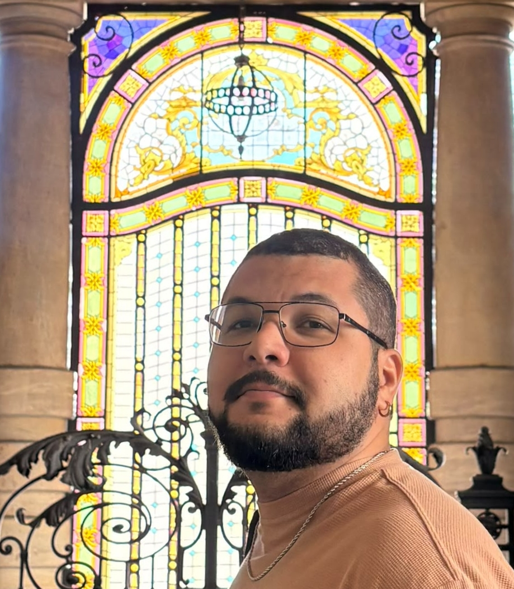

Nerd por vocação e inquieto por natureza. Ou seria o contrário? 🤔

Nascido e criado na *quintura* de Fortaleza, hoje faço da *friaca* de Curitiba o meu lar. Confesso que meu ideal de férias tem pé na areia e uma caipirinha de siriguela, mas é nesse clima geladamente antissocial que meu dia a dia funciona melhor.

Minha jornada acadêmica e profissional já passou por Publicidade, Cinema, Análise e Desenvolvimento de Sistemas, Ciência de Dados e Matemática. No caminho, vesti vários chapéus: fui designer, servidor público, professor, editor de vídeo e diretor de arte. Hoje, atuo como líder técnico, focado em resolver problemas no universo do varejo.

Se o ditado diz que “quem se define, se limita”, então, limitado que sou, estou tudo isso e nada disso ao mesmo tempo, coexistindo no hoje. Amanhã é outro rolê.

Já não uso mais redes sociais. Se você trombar com algum perfil meu por aí, saiba que é apenas um fantasma digital que não me dei ao trabalho de deletar.

Mas, se quiser trocar uma ideia de verdade, o [LinkedIn](https://www.linkedin.com/in/ogustavobelo/) é o melhor caminho para assuntos profissionais. Se o papo for pessoal, pode me mandar um [e-mail](mailto:ogustavobelo@gmail.com).
