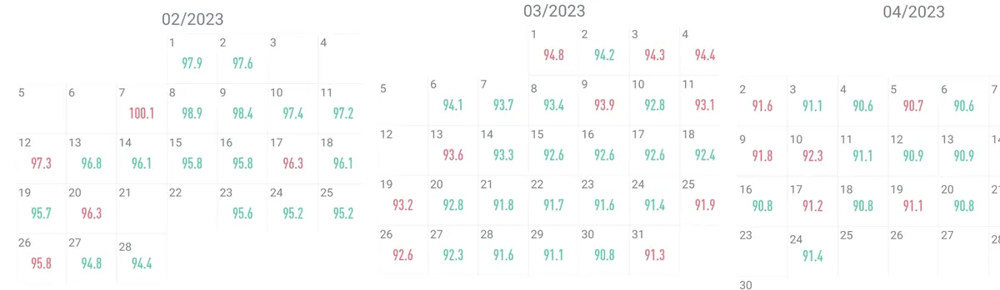

+++
title = "Metas morro acima"
date = "2025-01-04T14:36:00+00:00"
draft = false
tags = ["ensaios", "metas", "rotina"]
bear_uid = "trajGWwKDmgtQKQPXZFq"
+++



Todo fim de ano eu escrevo uma carta pra mim do futuro usando o [future.me](https://www.futureme.org/letters/new) com meus aprendizados do ano que passou e uma lista de metas que quero alcançar no ano seguinte. Um tópico recorrente que sempre está na lista é manter uma vida saudável. Em alguns anos coloquei algo apenas como "se alimentar melhor", em outros anos tentei ser mais objetivo e foquei no "estar com 90kg e 12% de bf". 
O fato de este tópico estar recorrente nas minhas metas é porque eu não consigo alcançá-lo. Tá bom que na grande maioria das vezes eu sequer tentei, mas isso é apenas um detalhe xD.

O mais próximo que cheguei de um resultado satisfatório foi no ano de 2023, onde depois de ir pra praia no carnaval, eu voltei extremamente insatisfeito com meu corpo. Naquele momento, eu estava com 104 kg e no meu maior nível de sedentarismo já alcançado. Voltei obstinado a reverter esse quadro e fiz uma dieta severa e me matriculei na academia. Nesta época mais focada, até para nutricionista eu fui. Assistia vídeos diários dos maromba-fluencers. Lia artigos e mais artigos sobre suplementação, déficit calórico, jeito certo de malhar, etc. Comprei uma balança e me pesava diariamente:

Ia para academia todos os dias, pesava as comidas e registrava-as em um aplciativo com peso e foto. Ter comido corretamente me estimulava a malhar, e ter malhado corretamente me fazia pensar duas vezes antes de comer besteiras. \
==Criei uma rotina e a mantinha na risca.== \
Comecei a jornada, em fevereiro, com 104kg e em Setembro cheguei no meu melhor peso em muito tempo, estava com 87kg e 14% de gordura corporal. \
Foi excepcional. Minha auto estima estava melhor. Minha saúde mental estava melhor.
Até que, após passar muito mal por algumas vezes, precisei passar por uma [Colecistectomia](https://pt.wikipedia.org/wiki/Colecistectomia). Fiquei 5 dias internado em jejum, comendo umas sopas de água suja e gelatinas, depois 1 mês sem poder fazer nenhum exercício físico pesado.\
Ou seja, acabou toda a rotina.

E aí foi ladeira a baixo, não consegui manter a dieta novamente. Não conseguia ir pra academia diariamente. Pane no sistema.

Eu sou uma pessoa metódica, gosto de metas e sei me planejar adequadamente para alcançá-las. \
Aprecio a jornada e desfruto do resultado. \
Mas o desafio das metas relacionadas a vida saudável é que ==enquanto você estiver vivo, a meta não acaba.==

É o castigo de [Sísifo](https://pt.wikipedia.org/wiki/O_Mito_de_Sísifo).

Nesses anos, empurrei minha pedra (a busca pela vida saudável) montanha acima. E assim como Sísifo, toda vez que chegava perto do topo - fosse por uma cirurgia ou simplesmente pelo cansaço da rotina - via minha pedra rolar montanha abaixo, levando consigo todos os progressos conquistados. \
==É preciso entender que o objetivo não é que a pedra fique em cima da montanha.==

Pensando nisto, esse ano vou usar uma abordagem diferente.
Meu objetivo será conseguir fazer exercícios 3 vezes por semana e só comer *fast-food*, no máximo, uma vez por mês. \
==A meta vai ser a jornada.== \

Vai dar certo? Não faço ideia mas trarei atualizações ao longo do ano.
