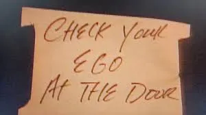

+++
title = "A Noite que Mudou o Pop"
date = "2025-02-21T12:44:35.874404+00:00"
draft = false
tags = ["review", "filmes", "netflix", "documentario"]
bear_uid = "sPWWFWIbpvFRDPGupnBI"
+++



Se me dissessem: assiste aqui esse filme onde vários estadunidenses vão se juntar para acabar com a fome do mundo com o poder da música. Eu com certeza riria e acharia que é uma referência de Ursinhos Carinhosos.

Uma coisa que também me fez torcer o nariz foi o título. A Noite que Mudou o Pop é de uma prepotência sem tamanho, até que eu percebi que essa conotação vem da tradução do título para o português. Só eu que achei essa mudança na tradução completamente boba?

Mas confesso que nos primeiros 15 minutos, o documentário [A Noite que Mudou o Pop](https://www.netflix.com/title/81720500) me pegou. Como coordenar 47 músicos em uma mesma sala para cantar uma mesma música? Não qualquer músico, celebridades ultrarrelevantes que em sua maioria cantavam de maneira solo. Astros que naturalmente pela sua gravidade centralizam as atenções sem qualquer esforço. 
Formaram um time só de camisas 10, que nunca treinaram juntos, e botaram pra jogar. O único jeito de fazer isso é colocando o ego de lado. Os trechos com o Bruce Springsteen ficando em silêncio por não conseguir atingir notas mais agudas, ou do Bob Dylan pedindo ajuda ao Stevie Wonder para se adequar ao ritmo são muito didáticos.

Eu conhecia de maneira muito vaga a música. Remetia remotamente ao Michael Jackson e só. Não tinha a menor noção de todo o esforço colocado para executá-la e de toda a história e repercussão por trás. O documentário é uma excelente ferramenta para deixar essa história viva e rememorar as gerações mais recentes deste acontecimento.
