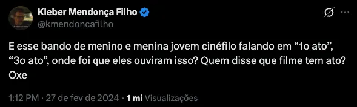

+++
title = "Clair Obscure - Expedition 33"
date = "2026-01-12T18:01:00+00:00"
draft = false
tags = ["games", "ps5", "review"]
bear_uid = "RoiupSzTergtThoaYPZp"
+++



## Assistindo um jogo

Existe uma diferença, sútil mas muito significativa, entre audiovisual e cinema. Os jogos de maneira geral estão totalmente inclusos no primeiro, mas cada vez mais inseridos no segundo. Produção de filmes e séries baseados em jogos está cada vez mais popular justamente por esta diferença estar ficando cada vez mais estreita. Não precisa mais criar uma narrativa e trama para levar os personagens para telona, como aconteceu com aquela leva dos anos 90. Basta pegar o "mesmo roteiro" com os mesmos diálogos, com a mesma história e mundo e transpilar para a telinha. A reclamação do público vai ser justamente nos detalhes que estavam diferentes.

O hábito de assistir (tal como cinema) jogos faz parte do meu dia a dia há muito tempo. Recentemente, fiz isso com o [Dispatch](https://pt.wikipedia.org/wiki/Dispatch_(videogame)), um jogo que é majoritariamente narrativa com pequenas interações. Eu, o Arthur(e o nosso reacteiro favorito) acompanhamos a história do começo ao fim, em uma sentada, como fazemos com animações seriadas. COE33 foi a primeira vez que senti o oposto, ==eu estava jogando um filme==.

Espero não estar ferindo o sentimento de ninguém com essa constatação. Eu, desde que ouvi falar deste jogo pela primeira vez, sabia que ele não era pra mim, nunca fui muito fã de RPG japonês, mas o E33 foi vendido como o melhor JRpg para quem não gosta de JRpgs e, como mencionei na postagem do [Ghost of Yotei](https://www.gustavobelo.com/ghost-of-yotei/), eu realmente estava curioso com toda esta empolgação em cima da obra. Estamos falando do jogo mais indicado e vencedor do TGA. Isso deve significar alguma coisa, certo?

## O que significa ser o melhor jogo?

> Enquanto filme, Robô Selvagem me marcou muito mais. Mas enquanto produção cinematográfica, Flow fez algo histórico e por conta disto a laureação foi mais do que merecida.
> [Postagem sobre o filme Flow](https://www.gustavobelo.com/flow/)

Na postagem do filme Flow eu faço uma análise de como mudei minha opinião sobre qual filme eu achava que deveria ter ganhado o Oscar de animação de 2025. Assim como a animação em questão, aqui também tivemos uma batalha de Davi contra Golias.

Se você não tá por dentro, o jogo foi desenvolvido pela estreante Sandfall Interactive, um estúdio com pouco mais de 30 funcionários fundada por dissidentes da Ubisoft ([mais detalhes](https://www.unrealengine.com/pt-BR/developer-interviews/inside-the-development-journey-of-clair-obscur-expedition-33)).
Então, esta mensagem ficava muito clara em todas as premiações. Em um contexto onde muito se discute obras e mais obras desenvolvidas por estúdios milionários apenas com a sequência sem alma de uma história que vende muito, tivemos esta sensação de frescor com uma obra bem original e artisticamente muito bem acabada. 
Este ponto é indiscutível, Clair Obscur: Expedition 33 é minuciosamente refinada. A trilha sonora é estonteante, acho que foi a primeira vez que me vi jogando majoritariamente de fone de ouvidos para apreciar cada detalhe. As cut-scenes são belíssimas, mesmo mantendo o visual in-game, tudo tem muita vida e expressão. Visualmente conseguiram replicar a sensação de estar dentro de uma pintura, o que para um universo tridimensional interativo é bastante complexo.

Só que pra mim, nem tudo são flores. Ou como mostra no jogo, tudo vira flores. Achei a jogabilidade muito repetitiva. A exploração do universo é extremamente limitada e pouco intuitiva (existe uma explicação narrativa para isto mas não importa) o que deixa maçante caminhar nos cenários. Acho que fica tão óbvio isso que foram criados momentos para variar esta exploração entre o macro e o micro que, no meu entendimento, só deixou tudo mais chato. As batalhas foram vendidas como mega dinâmicas e inovadoras, o que eu discordo absurdamente. Super normal passar 1 hora de jogo repetindo a mesma sequência de botões, com as mesmas animações, e por errar microsegundos entre estas interações ter que começar tudo de novo. Como eu disse, não é meu tipo de jogo.

## Precisava de 3 atos?

A história é inegavelmente boa. Desde o início a trama mexe com uma parte de você que quer entender do que aquilo se trata. Não lembro de nada parecido com o plot desta obra: a cada ano que passa acontece um ritual onde pessoas simplesmente desaparecem baseado em um número pintado na parede.
Você quer avançar para entender esse universo. Quais são as regras que regem aquela definição? Por que as pessoas precisam desaparecer? O que aconteceu com as outras? Que tipo de magia é aquela? 

E essa sensação estranha ti persegue ao longo de boa parte do jogo, aparecem novas criaturas esquisitas, novas regras estranhas e até o pouco que você achava que sabia deixa de fazer sentido ao avançar da aventura. E você avança, e avança mais, e mais um pouco, até que chega no desafio final e... foi a primeira vez que eu senti que terminei o jogo e ainda não tinha entendido porcaria nenhuma, até que você é mais uma vez surpreendido.

Não vou adentrar em mais detalhes para não estragar a experiência de ninguém, mas é um final que vale a pena conhecer. Quando tudo se encaixa e faz sentido, você deslumbra a beleza da mensagem. É, literalmente, como se estivéssemos vendo o quadro tão de perto, tão próximo da tinta, que você não entendia a pintura só um borrão. Que bom que eu me obriguei a superar a barreira entediante do jogo para poder deslumbrar as mensagens que esta obra reservou para o final. 

Peguei-me várias vezes refletindo sobre forma e conteúdo. 
Será que a estrutura narrativa encaixou com a cadência que o jogo impõe? Será que a contação da história foi tão fora da caixinha que é normal gerar este estranhamento? Qual o equilíbrio entre jogabilidade e storytelling? 

Fico me perguntando se eu teria curtido muito mais essa obra audiovisual sem a parte interativa, se eu tivesse apenas assistido como uma sequência de imagens com a trilha sonora, quem sabe em uma tela grande, no escuro, talvez comendo uma pipoca...
